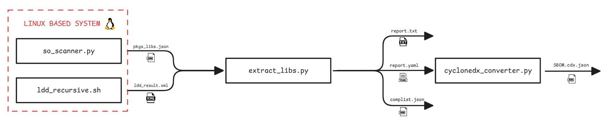
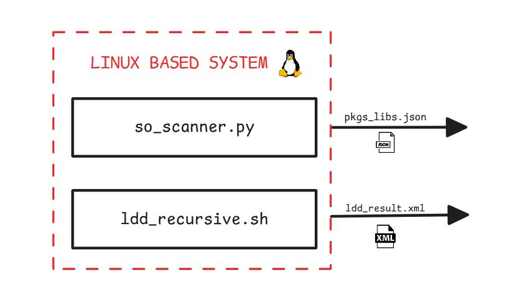
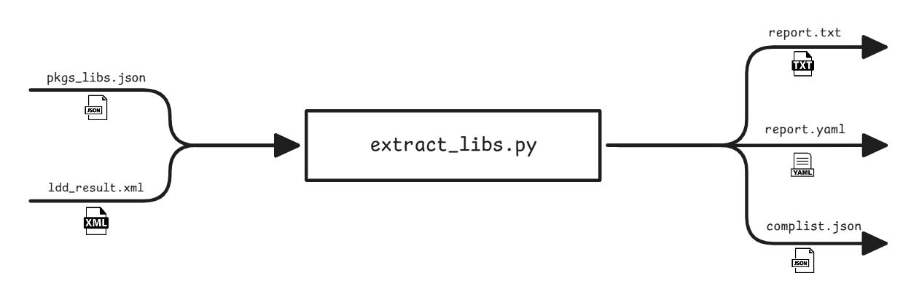
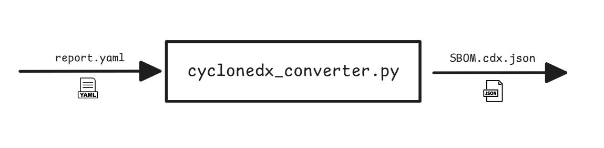

# SBOM Tracer

Este proyecto reúne varios scripts diseñados para recopilar la mayor cantidad de información posible con el fin de generar listados SBOM en formato CycloneDX JSON.

Permite obtener todas las bibliotecas dinámicas presentes en un sistema y asociarlas con sus paquetes fuente correspondientes. También puede extraer todos los paquetes y dependencias de una instalación Linux y exportarlos en diferentes formatos legibles: informes utilizando el [esquema de PTXDist](#esquema-report-ptxdist-formato-yaml) en YAML, listados de componentes en JSON y resúmenes en TXT. Además, es capaz de generar los archivos SBOM finales en formato CycloneDX JSON.

<p align="center">
  
</p>

## Instalación

Se recomienda utilizar un entorno virtual para aislar dependencias y o tener que ejecutar todas los paquetes de pip en el sistema.

### 1. Instalación mediante script

Dar permisos de ejecución al script de setup.

```bash
chmod +x ./setup.sh
```

Ejecutar el script de setup

```bash
./setup.sh
```

### 2. Instalación manual

#### Crear un entorno virtual de python:

```bash
python3 -m venv venv
```

#### Activar el entorno virtual:

**Linux / macOS**

```bash
source venv/bin/activate
```

**Windows**

```bash
venv\Scripts\activate
```

#### Instalar dependencias

Todas las dependencias necesarias están listadas en `requirements.txt`.

```bash
pip install -r requirements.txt
```

## Crear listado de paquetes y librerías dinámicas (pkg: <lib_name\>.so) (so_scanner.py)

### Requisitos

Para el script ([`so_scanner.py`](#so_scannerpy-crear-listado-de-paquetes-y-librerías-dinámicas-pkg-lib_nameso)) es necesario que el sistema contenga el gestor de paquetes DPKG, esto es, que el sistema esté basado en Debian.

### Configuración

El script no necesita configuracion alguna, pero es necesario que el sistema en el que se desee ejecutar el script contenga un gestor de paquetes, preferiblemente siendo DPKG. Esto se debe a que el script verifica si el sistema contiene DPKG.

### Uso 

Al ejecutar el script este busca en el sistema todas las librerías dinamicas que pueda encontrar, en los directorios proporcionados. Después itera por esa lista para buscar a que paquete pertenecen cada uno de los .so encontrados. Todo ello lo guarda y devuelve un listado de paquetes con todas las librerías que contiene cada una en formato JSON con el siguiente ([esquema](#inventario-de-paqueteslibrerías-en-json))

<p align="center">
  
</p>

El script se puede ejecutar de la siguiente manera:
```bash
python3 so_scanner.py -v -w 64 --pretty -o libraries.json
```

Se puede obtener toda la información para la ejecución del script mediante:

```bash
python3 so_scanner.py -h
```

```bash

╔═══════════════════════════════════════════════════════════════╗
║              Escáner de Librerías .so del Sistema             ║
║                        Versión 1.0.0                          ║
╚═══════════════════════════════════════════════════════════════╝

usage: so_scanner.py [-h] [-o ARCHIVO] [-v] [-vV] [--pretty] [-w N] [--examples] [--version]

Escáner de librerías .so del sistema - Mapea librerías compartidas a paquetes

options:
  -h, --help            show this help message and exit
  -o ARCHIVO, --output ARCHIVO
                        Nombre base para archivos de salida JSON. Se generarán 3 archivos: installed_<ARCHIVO>, suggested_<ARCHIVO>, unknown_<ARCHIVO> (por defecto: salida a stdout)
  -v, --verbose         Modo verbose - Muestra información de progreso y estadísticas
  -vV, --ultra-verbose  Modo ultra-verbose - Muestra información detallada de depuración para cada archivo procesado
  --pretty              Formatea el JSON con indentación para mejor legibilidad
  -w N, --workers N     Número de workers (hilos) para procesamiento paralelo. Por defecto: CPU_COUNT × 4 (típicamente 32)
  --examples            Muestra ejemplos de uso del programa
  --version             show program's version number and exit

Para ver ejemplos de uso detallados, ejecuta: so_scanner.py --examples

EJEMPLOS DE USO:
═══════════════════════════════════════════════════════════════

1. Escaneo básico con salida en pantalla:
   $ ./so_scanner.py

2. Escaneo con salida formateada a archivos JSON:
   $ ./so_scanner.py -o libraries.json --pretty

3. Escaneo con modo verbose para ver el progreso:
   $ ./so_scanner.py -v -o libraries.json

4. Escaneo con modo ultra-verbose (depuración detallada):
   $ ./so_scanner.py -vV -o libraries.json

5. Ajustar número de workers (hilos paralelos):
   $ ./so_scanner.py -v -w 16 -o libraries.json

6. Escaneo rápido con máximo paralelismo:
   $ ./so_scanner.py -v -w 64 --pretty -o libraries.json

7. Escaneo en modo debug con pocos workers:
   $ ./so_scanner.py -vV -w 4 -o libraries.json

8. Ver esta ayuda:
   $ ./so_scanner.py --help
   $ ./so_scanner.py --examples

SALIDA:
═══════════════════════════════════════════════════════════════
El programa genera 3 archivos JSON (o 3 secciones en stdout):

• installed_<nombre>.json  → Librerías de paquetes instalados
• suggested_<nombre>.json  → Librerías de paquetes sugeridos
• unknown_<nombre>.json    → Librerías sin paquete conocido

FORMATO JSON:
═══════════════════════════════════════════════════════════════
{
  "package": "libc6",
  "libraries": [
    "libc.so.6",
    "libm.so.6"
  ]
}

REQUISITOS:
═══════════════════════════════════════════════════════════════
• Sistema Debian/Ubuntu (requiere dpkg)
• apt-file (instalado automáticamente si no está presente)

```


## Extraer paquetes desde listado de librerías (XML) (extract_libs.py)

### Requisitos

El script `extract_libs.py` precisa de los siguientes ficheros de datos y establecer las variables de entorno definidas en el apartado de configuración, esto es importante si se requiere el mapeo de librerías a paquetes, de vital importancia para el procesamiento de archivos XML extraidos con el script de bash `ldd_recursive.sh`, ya que sin esto solamente aparecerá la informacion de librerías dinamicas.

- Fichero donde se especifiquen el contenido de librerías de cada paquete en formato JSON ([Ver ejemplo de esquema aqui](#inventario-de-paqueteslibrerías-en-json)).

- Archivo del report completo del BSP o firware en la que se evaluarán las aplicaciones, en formato YAML y [esquema utilizado por PTXDist](#esquema-report-ptxdist-formato-yaml).

### Configuración

Antes de ejecutar el script se deben establecer las variables de entorno que se utilizarán por defecto en el script. Esto es, se utilizarán como directorios default para el caso en el que no se introduzcan los argumento `--lib-lists` y `--bsp-report`

Estos hacen referencia  primeramente al directorio donde se ubican las listas con los mapeos de nombres de librerías (.so) a paquetes.

```bash
export LIBS_DIR="/"
```

Y también el report completo del firmware o BSP extraído del sistema (linux) donde se ejecutará la aplicación, en el caso de que sea posible y se tenga acceso al fichero.

```bash
export PTX_REPORT="/"
```

### Uso

El script lista todos los paquetes que existen entre todas las librerías en el fichero XML y lo procesa para tener la información mas accesible y legible. Además, también se puede obtener un archivo en formato YAML basado en los report creados con el [esquema de PTXDist](#esquema-report-ptxdist-formato-yaml) para poder obtener el SBOM final. 

<p align="center">
  
</p>

El script requiere de diversos argumentos para su ejecución.

Ejemplo **XML**:

```bash
python3 extract_libs.py xml <ldd_resultfile.xml> --lib-lists /path/to/dir --bsp-report base_report.yaml -j <complist.json> -t <report.txt> -y <report.yaml>
```

Ejemplo **DPKG**:

```bash
python3 cyclonedx_converter.py dpkg <dpkg_status.txt> --dpkg-name NAME --dpkg-vers VERSION -j <complist.json> -t <report.txt> -y <report.yaml>
```

Se puede obtener toda la información para la ejecución del script mediante:

```bash
python3 extract_libs.py -h
```

```bash
╔══════════════════════════════════════════════════════════════════════════╗
║              Extraer paquetes desde listado de librerías (XML)           ║
║                              Versión 0.0.0                               ║
╚══════════════════════════════════════════════════════════════════════════╝

Uso:python3 extract_libs.py [-h] [--no-console] [-s] [--examples] [-v] {xml,dpkg} ...

Analizador de dependencias desde archivos

Argumentos Posicionales:
  {xml,dpkg}          Tipo de archivo a procesar
    xml               Procesar fichero XML (creado por ./ldd_recursive.sh)
    dpkg              Procesar datos extraídos desde dpkg/status

Opciones:
  -h, --help          show this help message and exit
  --no-console        No mostrar salida en consola
  -s, --summary-only  Mostrar solo resumen (sin dependencias detalladas)
  --examples          Muestra ejemplos de uso del programa
  -v, --version       show program's version number and exit

Para ver ejemplos de uso: python3 extract_libs.py --examples

  USE EXAMPLES:
  ═══════════════════════════════════════════════════════════════
  # Procesamiento de archivos XML (generados por ./ldd_recursive.sh)
  extract_libs.py xml file.xml                                    # Análisis básico en terminal
  extract_libs.py xml file.xml -j output.json                     # Exportar solo JSON
  extract_libs.py xml file.xml -t report.txt                      # Exportar solo reporte texto
  extract_libs.py xml file.xml -y deps.yaml                       # Exportar solo YAML
  extract_libs.py xml file.xml -j deps.json -t deps.txt           # Exportar múltiples formatos
  extract_libs.py xml file.xml --no-console                       # Sin salida en terminal
  extract_libs.py xml file.xml -s                                 # Solo resumen
  extract_libs.py xml file.xml -m                                 # Crear mapeo lib->pkg
  extract_libs.py xml file.xml --lib-lists /path/to/dir           # Usar directorios con mapeos
  extract_libs.py xml file.xml --bsp-report base_report.yaml      # Usar reporte BSP del sistema base
  
  # Procesamiento de archivos DPKG
  extract_libs.py dpkg dpkg_status --dpkg-name "Sistema" --dpkg-vers "1.0"  # Análisis DPKG
  extract_libs.py dpkg dpkg_status -j output.json                           # Exportar a JSON
  extract_libs.py dpkg dpkg_status -y deps.yaml                             # Exportar a YAML

```

## Convertir report (YAML) a CycloneDX SBOM (cyclonedx_converter.py)

### Requisitos

Para utilizar el script de `cyclonedx_converter.py` se necesita tener conexión a la URL de la base de datos de NVD de NIST y a ser posible también una API_KEY para hacer las peticiones a un mayor rate limit. Además también se necesita un fichero de datos con [estructura de PTXDist report](#esquema-report-ptxdist-formato-yaml) en formato YAML para poder procesarlo.

### Configuración

El script requiere de la configuración para el acceso a la base de datos de NVD(NIST) donde se alojan los datos de todos los CVE y CPE del gobierno de los Estados Unidos.

Esto se debe de hacer mendiante las variables de entorno, configurando el endpoint donde se ubica la API de la base de datos y la API key, en el caso de que esté disponible. 

La API key sirve para tener un rate limit ampliado, el cuál está limitado por las reglas de firewall de NIST. Con una API key se obtiene una rate limit de 50 requests por 30 segundos frente a los 5 requests por 30 segundos (sin API key). Se puede obtener en la siguiente url [Request an API Key](https://nvd.nist.gov/developers/request-an-api-key).

```bash
export API_KEY="tu_api_key"
export TARGET_URL="https://services.nvd.nist.gov/rest/json/cpes/2.0"
```

### Uso

El script convierte ficheros con el [esquema reporte de PTXDist](#esquema-report-ptxdist-formato-yaml) originales o customizados (creados con [extract_libs.py](#extraer-paquetes-desde-listado-de-librerías-xml)) en formato YAML a ficheros de listado de materiales de software (SBOM) en formato CycloneDX JSON.

<p align="center">
  
</p>

El script requiere de diversos argumentos para su ejecución.

Ejemplo:

```bash
python3 cyclonedx_converter.py -t ptx full-bsp-report.yaml -o bsp-sbom.json
```

Se puede obtener toda la información para la ejecución del script mediante:

```bash
python3 cyclonedx_converter.py -h
```

```bash
╔══════════════════════════════════════════════════════════════════════════╗
║                  Convertir report (YAML) a CycloneDX SBOM                ║
║                              Versión 0.0.0                               ║
╚══════════════════════════════════════════════════════════════════════════╝

Usage: python3 cyclonedx_converter.py [-h] [--examples] -t {ptx,firmware,prg,hmi,application,other} -o OUTPUT [-n NAME] [-v] [-q] [-s] yaml_file

Convert YAML reports (PTXdist/Custom) to CycloneDX SBOM

Positional Arguments:
  yaml_file             Input YAML report file

Options:
  -h, --help            show this help message and exit
  --examples            Muestra ejemplos de uso del programa
  -t {ptx,firmware,prg,hmi,application,other}, --type {ptx,firmware,prg,hmi,application,other}
                        Type of YAML file to convert
  -o OUTPUT, --output OUTPUT
                        Output CycloneDX SBOM file (default: sbom.cdx.json)
  -n NAME, --name NAME  Document name (auto-detected if not specified)
  -v, --version         show program's version number and exit
  -q, --quiet           Suppress informational messages
  -s, --sign            Sign created SBOM file.

Para ver ejemplos de uso: python3 cyclonedx_converter.py --examples

  USE EXAMPLES:
  ═══════════════════════════════════════════════════════════════
  # Convert PTXdist report
  cyclonedx_converter.py -t ptx full-bsp-report.yaml -o bsp-sbom.json
  
  # Convert application report with custom name
  cyclonedx_converter.py -t prg app-report.yaml -o app-sbom.json -n "MyApp-v1.0"
  
  # Convert HMI report
  cyclonedx_converter.py -t hmi hmi-report.yaml -o hmi-sbom.json

  SUPPORTED TYPES:
  ═══════════════════════════════════════════════════════════════
  ptx         PTXdist BSP projects
  prg         Program/application projects
  hmi         HMI (Human-Machine Interface) projects
  application Generic application projects
  firmware    Firmware projects
  other       Other custom projects

```

## Estructura del Proyecto

```
SBOM_CREATION/
│
├─ config/
├─ data/
|
├─ cyclonedx_converter.py
├─ extract_libs.py
|
├─ ldd_recursive.sh
│
├─ requirements.txt
├─ README.md
└─ setup.sh
```

## Dynamic Library Finder (ldd_recursive.sh)

Para utilizar el siguiente script, solamente se necesita copiar el script de BASH al sistema en el que este se debe de funcionar y ejecutarlo mediante terminal.

Dar permisos de ejecución al script.

```bash
chmod +x ./ldd_recursive.sh
```

Ejecutar el script, introduciendo el path a la aplicación, el nombre de la aplicación y un directorio donde se guardará los ficheros de salida.

```bash
./ldd_recursive.sh /ruta/a/ejecutable <elf_name> /directorio/output
```

## Esquemas utilizados en el script

### Inventario de paquetes/librerías en JSON

Esquema del listado de librerías que contiene cada paquete en formato JSON.

```json
{
  "packages": [
    {
      "package": "gcclibs-12.2.1",
      "libraries": [
        "libstdc++.so.6",
        "libgcc_s.so.1",
        "libgomp.so.1",
        "libatomic.so.1",
        "libquadmath.so.0"
      ]
    },
    {
      "package": "glibc-2.36",
      "libraries": [
        "libc.so.6",
        "libm.so.6",
        "libpthread.so.0",
        "libdl.so.2",
        "libutil.so.1",
        "libanl.so.1",
        "librt.so.1",
        "libcrypt.so.1",
        "libresolv.so.2",
        "libnsl.so.1",
        "libnss_files.so.2",
        "libnss_dns.so.2",
        "libnss_hesiod.so.2",
        "libnss_compat.so.2",
        "libnss_nisplus.so.2",
        "libnss_nis.so.2"
      ]
    },
    { "package": "binutils-2.39",
     "libraries": [] }
  ]
}
```

Se puede ver el esquema completo en [`complist_schema.json`](./config/complist_schema.json)

### Lista de dependencias (librerías) en XML

Esquema del archivo xml creado por el script ./ldd_recursive.sh que busca las librerías.

Ejemplo:

```xml
<component type="application">
  <filename></filename>
  <name>FPP</name>
  <version>25220_02</version>
  <path></path>
  <hashes>
    <hash alg="MD5">352f001edb679dc648af117a84030274</hash>
  </hashes>
  <dependencies>
    <component type="library">
      <filename>libm.so.6</filename>
      <name>libm</name>
      <version>6</version>
      <path>/lib/libm.so.6</path>
      <hashes>
        <hash alg="MD5">56854374fe834cf12d082ecfc409e7c8</hash>
      </hashes>
      <externalReferences>
        <reference>
          <filename>libm.so.6</filename>
          <url>/lib/libm.so.6</url>
          <comment>Symbolic Link</comment>
        </reference>
      </externalReferences>
      <dependencies>
        <component type="library">
          <filename>libc.so.6</filename>
          <name>libc</name>
          <version>6</version>
          <path>/lib/libc.so.6</path>
          <hashes>
            <hash alg="MD5">dba2ef9eff0cfb1ef57150da1aa49a49</hash>
          </hashes>
          <externalReferences>
            <reference>
              <filename>libc.so.6</filename>
              <url>/lib/libc.so.6</url>
              <comment>Symbolic Link</comment>
            </reference>
          </externalReferences>
          <dependencies>
          </dependencies>
        </component>
      </dependencies>
    </component>
    ...
  </dependencies>
</component>
```

Se puede ver el esquema completo en [`libs_schema.xsd`](./config/libs_schema.xsd)

### Esquema CyclondeDX@1.5 formato JSON

El esquema completo utilizado se puede ver en [`bom-1.5.schema.json`](https://github.com/CycloneDX/specification/blob/master/schema/bom-1.5.schema.json)

### Esquema report PTXDist formato YAML

```yaml
ptxdist:
  version: <string>
  path: <path>

packages:
  <pkgname>:
    # metadatos del paquete
    name: <pkgname>
    rulefile: <path>
    menufile: <path>
    version: <string>
    srchash: <md5>
    cfghash: <md5>
    licenses: <string>
    license-section: <enum>
    builddeps: [<pkgname>, ...]
    rundeps: [<pkgname>, ...]
    url: [<url>, ...]
    source: <path>
    sources: [<path>, ...]
    md5: <md5|md5s>
    md5s: [<md5s>, ...]
    git-commit: <hash>
    patches: <path>
    series: <path>
    srcdir: <path>
    builddir: <path>
    pkgdir: <path>
    devpkg: <path>
    use-devpkg: <path>
    spdx-sbom: <path>
    cyclonedx-sbom: <path>
    license-files: <obj|array>
    files: [<path>, ...]
    ipkgs: [<path>, ...]
    pkgs: [<pkgname>, ...]
    cve-product: [<string>, ...]
    cve-version: <string>
```
